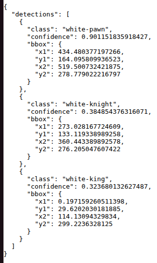

# Chess Piece Detection with YOLO

This project runs a YOLO model inside a Docker container using FastAPI.
The frontend uses Nginx to send images to the AI service.

## Requirements

- Docker
- Docker Compose

## How to Run

Clone the repository:

git clone https://github.com/RomeNUnt/chess-yolo-docker.git
cd chess-yolo-docker

Build and run:

docker compose up --build

P.S. if you built already, just run **docker compose up** and it should work fine.

Open in browser:

http://localhost

Upload a chessboard image to detect chess pieces.

## Screenshot

